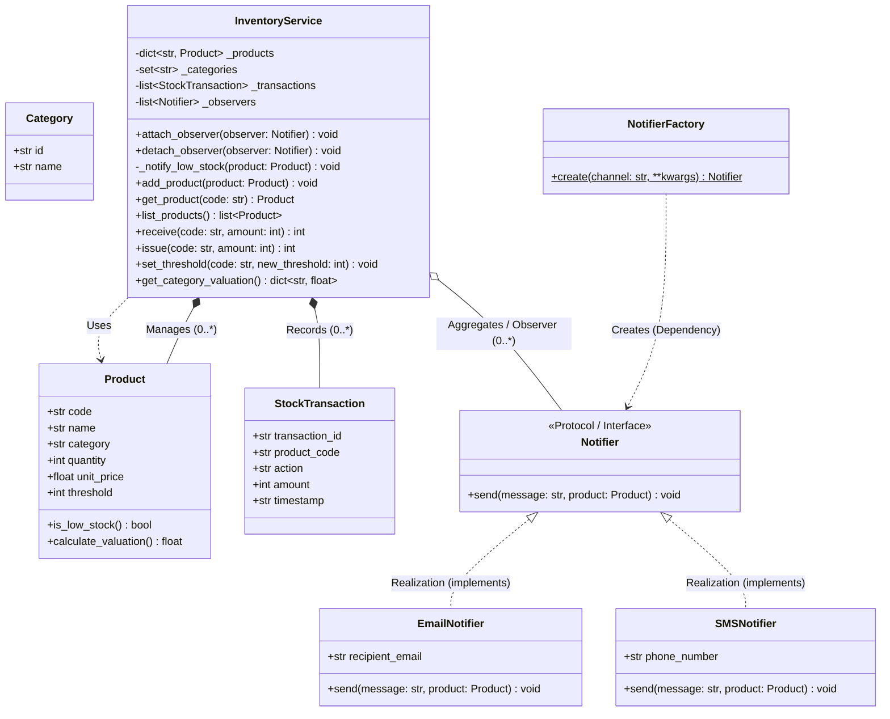

# Class Diagram: Inventory System (Lab 3)

Diagram นี้แสดงโครงสร้างคลาส ความสัมพันธ์ (Composition, Dependency, Realization) และการนำหลักการ SOLID / Design Patterns มาใช้

```mermaid
classDiagram
    class Product {
        +str code
        +str name
        +str category
        +int quantity
        +float unit_price
        +int threshold
        +is_low_stock() bool
        +calculate_valuation() float
    }

    class Category {
        +str id
        +str name
    }

    class StockTransaction {
        +str transaction_id
        +str product_code
        +str action
        +int amount
        +str timestamp
    }

    class Notifier {
        <<Protocol / Interface>>
        +send(message: str, product: Product) void
    }

    class EmailNotifier {
        +str recipient_email
        +send(message: str, product: Product) void
    }

    class SMSNotifier {
        +str phone_number
        +send(message: str, product: Product) void
    }

    class NotifierFactory {
        +create(channel: str, **kwargs)$ Notifier
    }

    class InventoryService {
        -dict~str, Product~ _products
        -set~str~ _categories
        -list~StockTransaction~ _transactions
        -list~Notifier~ _observers
        +attach_observer(observer: Notifier) void
        +detach_observer(observer: Notifier) void
        -_notify_low_stock(product: Product) void
        +add_product(product: Product) void
        +get_product(code: str) Product
        +list_products() list~Product~
        +receive(code: str, amount: int) int
        +issue(code: str, amount: int) int
        +set_threshold(code: str, new_threshold: int) void
        +get_category_valuation() dict~str, float~
    }

    %% Relationships
    Notifier <|.. EmailNotifier : Realization (implements)
    Notifier <|.. SMSNotifier : Realization (implements)
    NotifierFactory ..> Notifier : Creates (Dependency)
    InventoryService o-- Notifier : Aggregates / Observer (0..*)
    InventoryService *-- Product : Manages (0..*)
    InventoryService *-- StockTransaction : Records (0..*)
    InventoryService ..> Product : Uses
```
