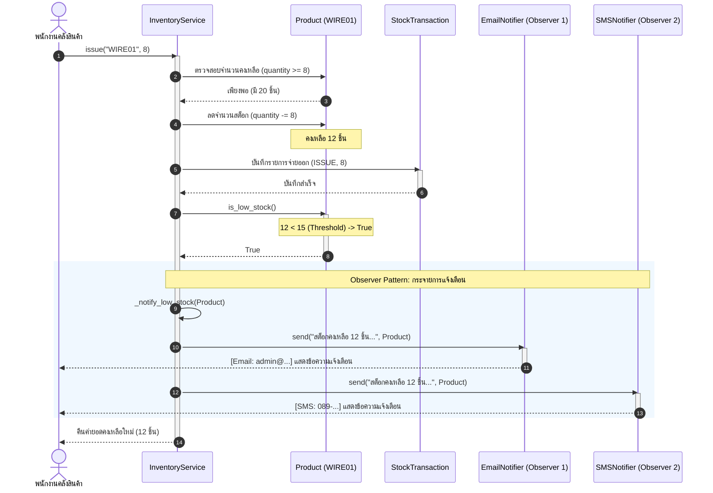

# Sequence Diagram: จ่ายสินค้าและแจ้งเตือนเมื่อสต็อกต่ำ (Lab 3)

Diagram นี้แสดง Flow การทำงานตั้งแต่พนักงานเรียกจ่ายสินค้าผ่าน `InventoryService.issue()` จนถึงการตรวจสอบเงื่อนไขสต็อกต่ำ และการกระจายแจ้งเตือนไปยัง Observers ทุกตัว

